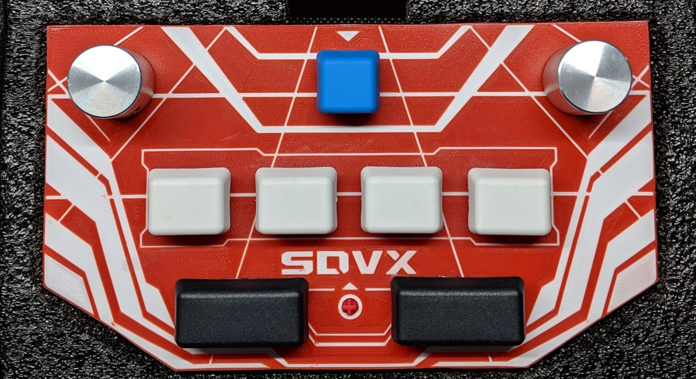
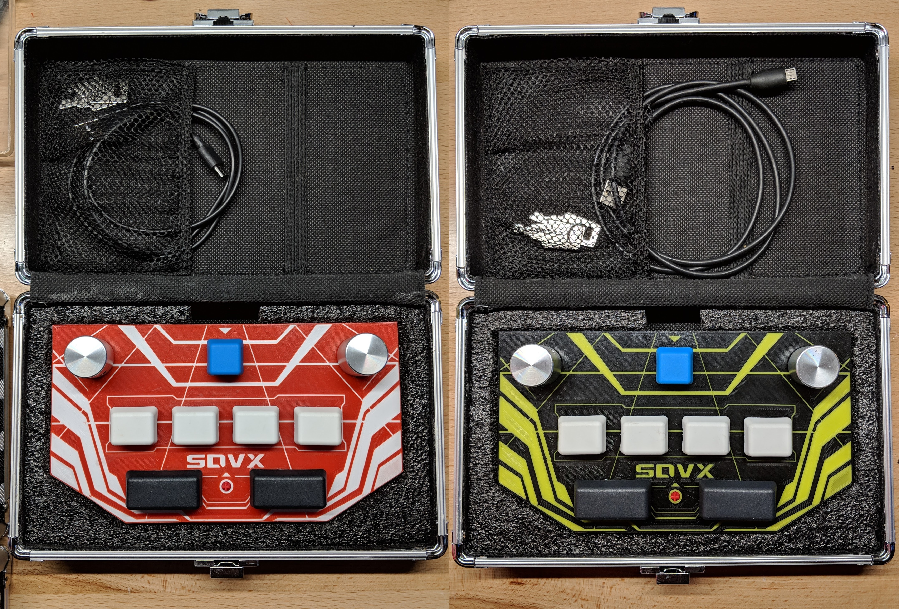
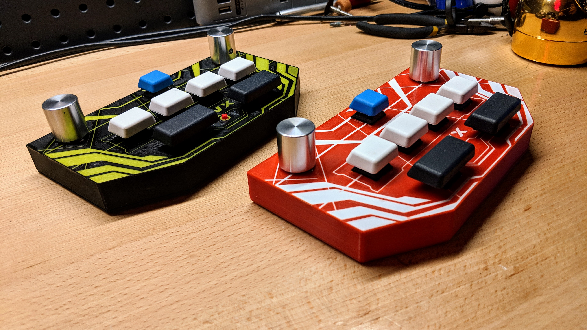
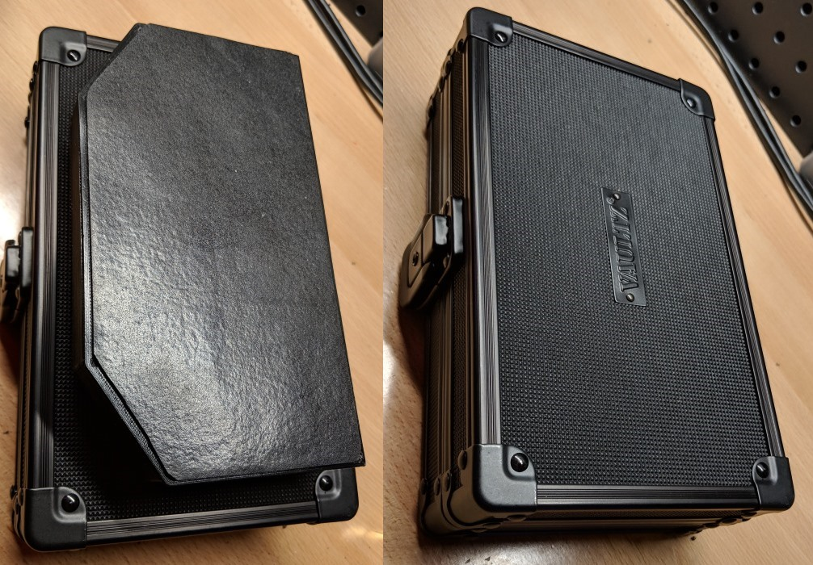

# pocketvtx
Based off of mon's popular pocket voltex controller, I'm offering an alternative with a dual-color 3D printed case! 

## Features
- Small enough to fit in your hand - Appx 7" x 4", and only 3/4" high (About 1-1/2" including knobs)
- Made to order:
  - Choose the base color and the wings color, I will send you a render before it's printed. 
  - Optional name laser engraving  on the bottom; will come standard with a Maxima engraving. 

- Polished aluminum knobs mounted on Bourns encoders
- Cherry MX Red switches with blue o-rings to shorten travel
- G20 blank keycaps
- Multi-function Macro key (card in/input pin/numpad_6 shortcut)
- Washable grippy pad with micro-suction technology. 
- Ships in Vaultz hardshell case with custom foam insert
- Micro USB Cable included

### Functions and Code
The code is a variant of 4yn/iivx (https://github.com/4yn/iivx). 

The macro key sends a numpad keyboard sequence of +1234 by default.  
- Press macro once to card in, and again to insert your pin once the pin screen loads.  
*Additional Functions*  
- Start + Macro = numpad_6; use to save your rate multiplier before the song starts.  
- Start + BTN-A+B+C+D + FX-L+R = /(numpad_divide); map this to the test button.  

### Misc Notes
I tried multiple materials for the bottom (rubber feet, mousepad material, etc), but the grippy pad I found turned out to be perfect size.  
Give the controller a good press down on the table for maximum grip. It won't slide around, and it still pulls up very easy.  
If the bottom of the pad becomes dirty, simply rinse it under water!  
  
If you wish to change the default pin number for the macro key, you can edit the included source code, or I can set your pin before I ship it.  
  
  
  
  

