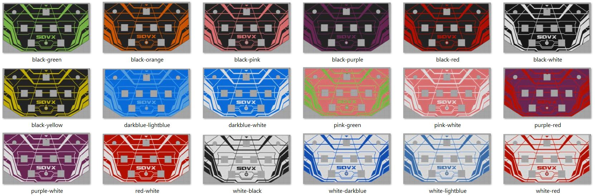
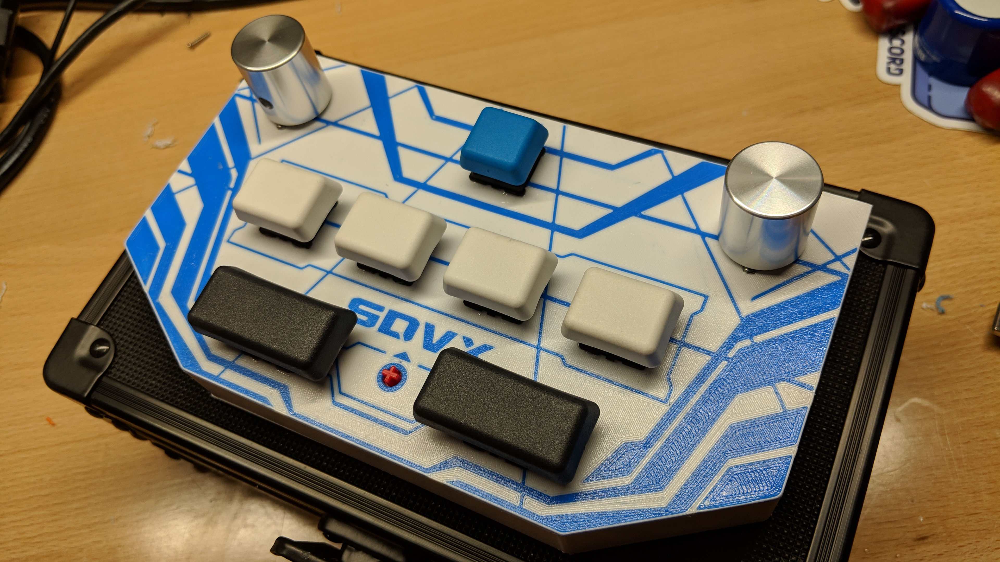
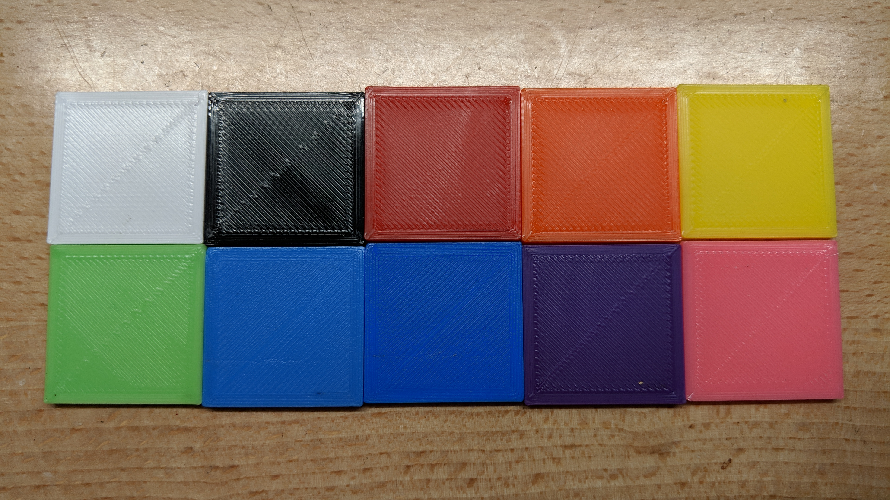

# pocketvtx
**See June code updates below!!**

Based off of mon's popular pocket voltex controller, I'm offering an alternative with a dual-color 3D printed case! 

  
High res renders available here: https://photos.app.goo.gl/bC4ZNHQHwgaDdzKu6

## Features
- Small enough to fit in your hand - Appx 7" x 4", and only 3/4" high (About 1-1/2" including knobs)
- Made to order:
  - Choose the base color and the wings color, I will send you a render before it's printed. 
  - Optional name laser engraving  on the bottom; will come standard with a Maxima engraving. 

- Polished aluminum knobs mounted on Bourns encoders
- Gateron Red switches with blue o-rings to shorten travel
- G20 blank keycaps
- Multi-function Macro key (card in/input pin/numpad_6 shortcut)
- Washable grippy pad with micro-suction technology. 
- Ships in Vaultz hardshell case with custom foam insert
- Micro USB Cable included

### Functions and Code
The code is a variant of 4yn/iivx (https://github.com/4yn/iivx). 

**June 2019 Update** *Added functionality for switching between keyboard/mouse and joystick mode. See below for details*  
**May 2019 Update** *Changed numpad functions to top row numbers instead.*

You can customize and upload code to the arduino by downloading the free Arduino IDE. https://www.arduino.cc/en/Main/Software
Select Arduino Leonardo as the board, select the port, and press Ctrl+U to upload. 

**NEW MODE FUNCTIONALITY** - Hold BTN-A or BTN-B while plugging in your controller to change between Keyboard/Mouse and Joystick mode, repsectively. The controller will remember your choice when you unplug it. 

**JOYSTICK MODE: (BTN-A)**
The macro key sends (backspace)1234 to the keyboard by default.   
- Press macro once to card in, and again to insert your pin once the pin screen loads.  
*Additional Functions*  
- Start + Macro = top row [6]; use to save your rate multiplier before the song starts.  
- Start + BTN-A+B+C+D + FX-L+R = [equals]; map this to the test button.  
**Spice is recommended for this! Use "Set Naive" and press equals on your keyboard. Set both keypads to None to accept keypad input from any device.**

**KEYBOARD/MOUSE MODE: (BTN-B)**
The controls are configured for kshoot as follows:  
Start: Enter  
Macro: ESC  
BTN:A: a  
BTN-B: s  
BTN-C: d  
BTN-D: f  
FX-L: z  
FX-R: x  

### Misc Notes
I tried multiple materials for the bottom (rubber feet, mousepad material, etc), but the grippy pad I found turned out to be perfect size.  
Give the controller a good press down on the table for maximum grip. It won't slide around, and it still pulls up very easy.  
If the bottom of the pad becomes dirty, simply rinse it under water! 
If the pad doesn't stick to the bottom of the controller well enough, coat the bottom of the controller with hairspray and let dry. 
  
If you wish to change the default pin number for the macro key, you can edit the included source code, or I can set your pin before I ship it.  
  
  
  
  

  
